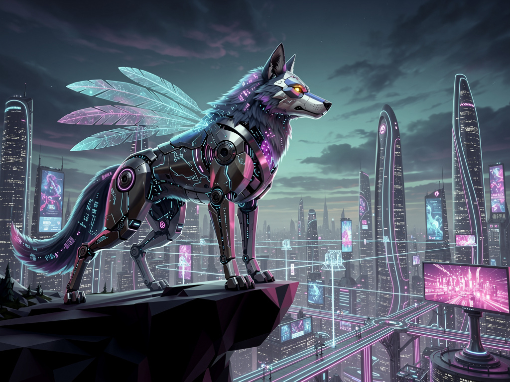
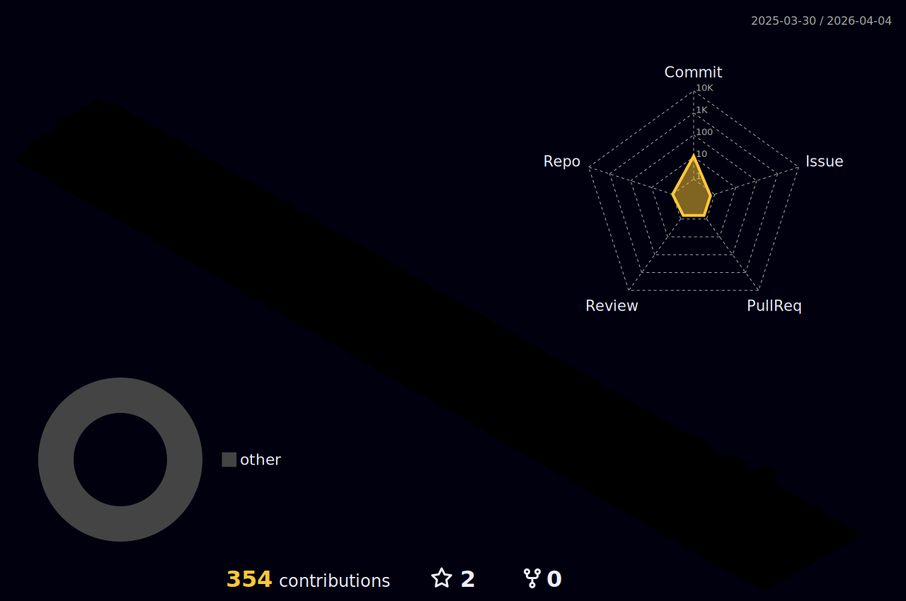

<!--
REPLACE THIS IMAGE URL:
I recommend generating a banner with Midjourney or DALL-E with the prompt:
"Cyberpunk digital wolf gazing at a futuristic city skyline, neon blue and purple colors, wide aspect ratio 2:1"
Upload it to your repo and link it here. For now, I am using a placeholder.
-->

<!-- Typing Effect Header -->

<!-- Social Badges -->

🐺 About The Architect

I am a Full Stack Software Engineer specializing in the convergence of decentralized technologies and Artificial Intelligence. With a background in Systems Engineering and advanced specialization from Universidad de Los Andes and 42 Wolfsburg, I build robust, scalable architectures that bridge the gap between Web2 utility and Web3 ownership.

🔭 Currently: Architecting Social Engagement & AI Data Labeling solutions at HUB.xyz.

🧬 Core DNA: Solidity, Rust, Next.js, and Large Language Models (Ollama).

🏆 Legacy: Helped build Chivo Wallet (El Salvador's Bitcoin infrastructure) and won ETHGlobal Bogota.

🛠️ The Arsenal

Blockchain & Web3

Modern Web & AI

Infrastructure & DevOps

🚀 Key Deployments

<table>
<tr>
<td width="50%">
<h3 align="center">🌐 HUB.xyz</h3>

Architected a Social Engagement solution unifying Web2 & Web3.

Designed a multimodal AI data labeling platform supporting major tech giants (Adobe, OpenAI).

</td>
<td width="50%">
<h3 align="center">🇸🇻 Chivo Wallet</h3>

Frontend development for El Salvador's official Bitcoin wallet.

Handled Template interaction for SSR functionalities and integration with Django backend.

</td>
</tr>
<tr>
<td width="50%">
<h3 align="center">🔐 CompilotAI</h3>

Engineered a core KYC/Identity Verification SDK widget for enterprises within the Web3 ecosystem using Next.js and tRPC.

</td>
<td width="50%">
<h3 align="center">🏛️ Quantum Temple</h3>

Led smart contract development for a multi-chain dApp (Ethereum/Algorand) managing NFT mints and auctions.

</td>
</tr>
</table>

🏆 Achievements & Hackathons

🥇 ETHGlobal Bogota 2022: Winner of 3 sponsor prizes (Streamr, WorldCoin, Pocket Network).

🐻 Bear Builders Hackathon: Winner of the Metis track (Ripio Blockchain).

🎓 Magna Cum Laude: Systems Engineering Degree (ULA).

📊 The Data

<!-- GitHub Stats Card -->

<!--  -->

<!-- Most Used Languages -->

<!--  -->

<!-- Streak Stats -->

<!-- Snake Animation (Requires Action Setup - See instructions below) -->

<em>"The strength of the wolf is the pack, and the strength of the pack is the wolf." — Rudyard Kipling</em>

